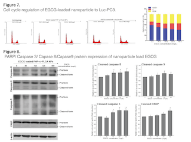
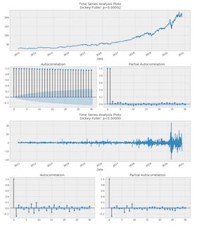
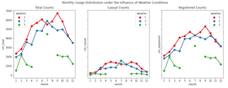

  

      <ul class="nav">
          <li><a href="{/assets/cychen_cv.pdf}">cv</a></li>
          <li><a href="https://github.com/carbondioxide9527">github</a></li>
          <li><a href="https://medium.com/@CYC.tw">blog</a></li>
          <li><a href="https://www.linkedin.com/in/chi-yun-chen-0093712/">LinkedIn</a></li>
      </ul>
  

### Portfolio
<table class="wide">
<tr>
  <td class="left">
    
  </td>
  <td class="right">
    
  </td>
</tr>
<tr>
  <td class="left">
    
  </td>
  <td class="right">
    
  </td>
</tr>
</table>

  

      <ul class="nav">
          <li><a href="index.html">back</a></li>
      </ul>
  

